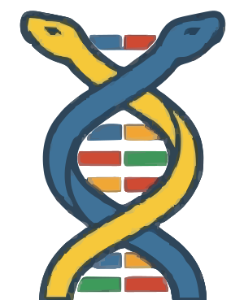

# Codify (Codon Language Server)

  

Codify is the official Visual Studio Code extension for the **Codon** programming language, a high-performance Python compiler that uses strict static typing.

Built as a fork of Pyright, Codify is modified to deeply integrate with Codon's compilation targets and provide strict typing safety nets directly in your editor.

## Features Added for Codon

* **Strict Type Mutation Enforcement**: Codon variables cannot change their type once initialized. Codify enforces this by injecting a strict compilation error whenever a variable's type is reassigned.
* **Safe Metaprogramming & Threads**: Protects `@par` concurrent iterations by categorically banning the `global` state keyword and tracking outer-scope object mutations directly within the AST analysis paths.
* **Codon File Recognition**: Provides rich, out-of-the-box language server support explicitly for `.codon` files.

## Documentation

For Pyright configuration usage, refer to [the documentation](https://microsoft.github.io/pyright).
For Codon specifications, refer to [the Codon documentation](https://docs.exaloop.io/codon/).
